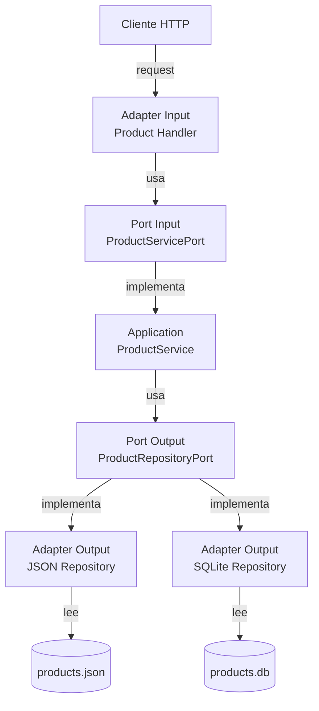
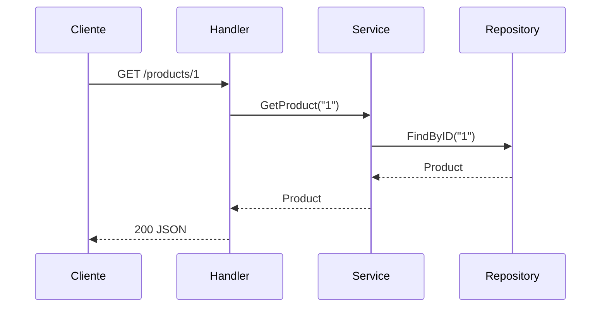
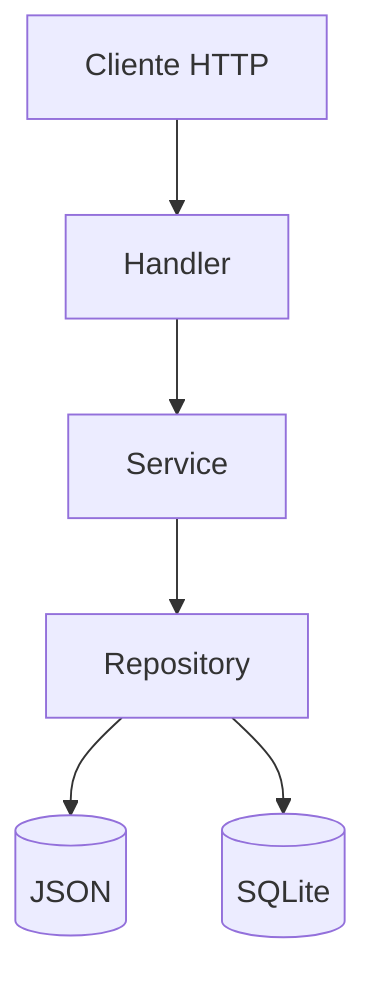

# Product Comparison API


API RESTful desarrollada en Go para comparar artículos del catálogo.

## Arquitectura

Este proyecto implementa **Arquitectura Hexagonal (Ports & Adapters)**, que permite
separar la lógica de negocio de los detalles técnicos como frameworks y bases de datos.





## Arquitectura diagrama




## Decisiones arquitectónicas

- **Arquitectura Hexagonal**: El dominio no depende de ningún detalle técnico externo.
  Los puertos son contratos (interfaces) y los adaptadores son implementaciones intercambiables.

- **Dos repositorios intercambiables**: Se implementaron dos adaptadores de salida
  (JSON y SQLite) que demuestran el poder de la arquitectura — se pueden intercambiar
  sin tocar la lógica de negocio.
  - JSON → simula persistencia sin dependencias externas
  - SQLite → demuestra intercambiabilidad del puerto de salida
  - Ambos implementan `ProductRepositoryPort` sin cambiar el dominio


- **Configuración por variable de entorno**: El repositorio activo se selecciona
  mediante `DB_TYPE` sin modificar código.

- **Errores tipados**: - `AppError` en dominio puro sin conocer HTTP
  - El handler traduce errores a códigos HTTP
  - Los logs internos tienen contexto completo
  - El cliente solo recibe información segura

- **Inyección de dependencias**: Todo se conecta en `main.go`, facilitando los tests con mocks.

- **Datos iniciales automáticos**: Ambos repositorios cargan datos de ejemplo al iniciarse,
  sin necesidad de pasos manuales.

- **¿Por qué no CQRS?**: 
- El problema solo requiere lectura de datos
- CQRS agregaría complejidad innecesaria
- Hexagonal pura es suficiente y más mantenible

## Estructura del proyecto

```
challenge-backend/
├── internal/
│   ├── domain/                          # Entidades y errores de negocio puros
│   │   ├── product.go                   # Entidad Product
│   │   └── errors.go                    # Errores tipados de dominio
│   ├── ports/
│   │   ├── input/                       # Contratos de entrada
│   │   │   └── product_port.go          # ProductServicePort
│   │   └── output/                      # Contratos de salida
│   │       └── product_port.go          # ProductRepositoryPort
│   ├── application/                     # Lógica de negocio pura
│   │   ├── product_service.go           # Implementa ProductServicePort
│   │   └── product_service_test.go      # Tests unitarios con mocks
│   └── adapters/
│       ├── input/
│       │   └── http/                    # Adaptador HTTP (Gin)
│       │       ├── product_handler.go   # Endpoints REST
│       │       ├── error_handler.go     # Traducción errores → HTTP
│       │       └── product_handler_test.go # Tests handler con mocks
│       └── output/
│           ├── json/                    # Adaptador JSON
│           │   ├── product_repository.go
│           │   └── product_repository_test.go
│           └── sqlite/                  # Adaptador SQLite
│               ├── product_repository.go
│               └── product_repository_test.go
├── data/
│   ├── products.json                    # Datos simulados JSON
│   └── products.db                      # SQLite (generado automáticamente)
├── postman/
│   └── product-comparison-api.json      # Colección Postman
├── main.go                              # Punto de entrada e inyección de dependencias
├── main_test.go                         # Tests de integración HTTP
├── .gitignore
└── README.md
```

### Responsabilidad de cada capa:

| Capa | Carpeta | Responsabilidad |
|------|---------|-----------------|
| Domain | `internal/domain` | Entidades y errores puros sin dependencias externas |
| Ports | `internal/ports` | Interfaces que definen contratos de entrada y salida |
| Application | `internal/application` | Lógica de negocio pura, solo conoce el dominio |
| Adapters Input | `internal/adapters/input` | Traduce HTTP a llamadas de dominio |
| Adapters Output | `internal/adapters/output` | Traduce dominio a JSON o SQLite |

## Requisitos

- Go 1.23+

## Instalación

```bash
git clone <url-del-repositorio>
cd <nombre-del-proyecto>
go mod tidy
```

## Ejecución

### Con repositorio JSON (por defecto)
```bash
go run main.go
```

### Con repositorio SQLite
```bash
# Windows PowerShell
$env:DB_TYPE="sqlite"
go run main.go

# Linux/Mac
DB_TYPE=sqlite go run main.go
```

> La base de datos SQLite se crea automáticamente en `data/products.db`
> con datos de ejemplo precargados. No requiere configuración adicional.

### Cambiar de SQLite a JSON
```bash
# Windows PowerShell
Remove-Item Env:DB_TYPE
go run main.go

# Linux/Mac
unset DB_TYPE
go run main.go
```

## Endpoints

| Método | Endpoint | Descripción |
|--------|----------|-------------|
| GET | `/products` | Lista todos los productos |
| GET | `/products/:id` | Obtiene un producto por ID |
| GET | `/products/compare?ids=1,2,3` | Compara múltiples productos |

## Ejemplos

### Listar todos los productos
```bash
curl http://localhost:8080/products
```

### Obtener producto por ID
```bash
curl http://localhost:8080/products/1
```

### Comparar productos
```bash
curl http://localhost:8080/products/compare?ids=1,2,3
```

### Respuesta exitosa
```json
[
  {
    "id": "1",
    "name": "Samsung Galaxy S23",
    "description": "Smartphone flagship con cámara de 50MP",
    "price": 2999999,
    "image_url": "https://example.com/samsung-s23.jpg",
    "rating": 4.5,
    "specifications": {
      "battery": "3900mAh",
      "ram": "8GB",
      "screen": "6.1 pulgadas",
      "storage": "128GB"
    }
  }
]
```

### Respuesta de error
```json
{
  "error": "producto no encontrado"
}
```

## Tests

### Ejecutar todos los tests
```bash
go test ./... -v
```

### Ver cobertura
```bash
go test ./... -cover
```

### Resultado esperado
ok   project                               coverage: 60.0%
ok   project/internal/adapters/input/http  coverage: 95.0%
ok   project/internal/adapters/output/json coverage: 78.3%
ok   project/internal/adapters/output/sqlite coverage: 83.3%
ok   project/internal/application          coverage: 88.2%

| Tipo | Archivo | Descripción |
|------|---------|-------------|
| Integración | `main_test.go` | Prueba endpoints HTTP completos |
| Unitarios | `internal/application/product_service_test.go` | Prueba lógica de negocio con mocks |
| Handler | `internal/adapters/input/http/product_handler_test.go` | Prueba handler con mocks |
| Repositorio JSON | `internal/adapters/output/json/product_repository_test.go` | Prueba repositorio JSON |
| Repositorio SQLite | `internal/adapters/output/sqlite/product_repository_test.go` | Prueba repositorio SQLite |

Total: **31 tests** distribuidos en todas las capas de la arquitectura.

## Tecnologías

| Tecnología | Uso |
|------------|-----|
| Go 1.23 | Lenguaje principal |
| Gin | Framework HTTP |
| Testify | Assertions y mocks en tests |
| modernc/sqlite | Driver SQLite pure Go |

## Documentación API (Swagger)

Los endpoints están documentados con anotaciones estándar Swagger/OpenAPI.

Para generar la UI interactiva:

```bash
# Instalar swag CLI
go install github.com/swaggo/swag/cmd/swag@latest

# Generar documentación
swag init

# Agregar dependencias
go get github.com/swaggo/gin-swagger
go get github.com/swaggo/files

# La UI estará disponible en:
http://localhost:8080/swagger/index.html
```

### Endpoints documentados:

| Método | Endpoint | Descripción |
|--------|----------|-------------|
| GET | `/products` | Lista todos los productos |
| GET | `/products/:id` | Obtiene producto por ID |
| GET | `/products/compare?ids=1,2` | Compara productos |

## Colección Postman

Importa la colección para probar todos los endpoints:

1. Abre Postman
2. Clic en **Import**
3. Selecciona `postman/product-comparison-api.json`
4. Asegúrate que el servidor está corriendo en `localhost:8080`

### Requests incluidos:
| Request | Método | Endpoint |
|---------|--------|----------|
| Health Check | GET | `/health` |
| Get All Products | GET | `/products` |
| Get Product By ID | GET | `/products/1` |
| Get Product Not Found | GET | `/products/999` |
| Compare Products | GET | `/products/compare?ids=1,2,3` |
| Compare iPhones | GET | `/products/compare?ids=2,4,5,6` |
| Missing Param | GET | `/products/compare` |
| Single ID Error | GET | `/products/compare?ids=1` |